# Writing and Presentation Test Week 1
## **Unix Command Line Git & GitHub Dasar**
### **Penjelasan**
- Command line interface sebenarnya yang dimaksud adalah shell yang berbasis teks. Shell ini program yang menerima perintah lalu meneruskan perintah tersebut ke system untuk dieksekusi.
- Aplikasi dibagi jadi 2 jenis dari 2 segi tampilan, contoh nya.

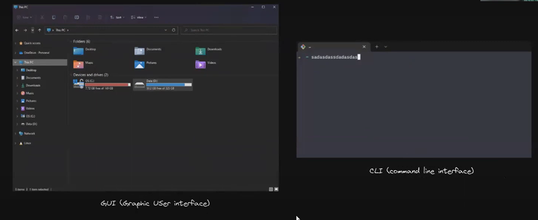

- GUI bisa kita klik klik, sedangkan lawannya command line dimana hanya berbasis teks saja.
- Contoh CLI yaitu sh, bash, zsh, cmd.exe.
- Filesystem yaitu struktur dari direktori atau file-file yang ada di computer kita. Mengatur bagaimana data disimpan dalam sebuah system. Berikut adalah gambar filesystem dibawah.

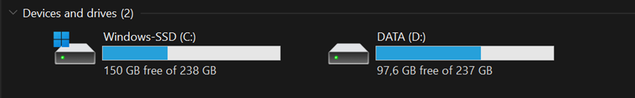

- pwd (print working directory) command yang digunakan untuk melihat current working directory.Contohnya (disini artinya bash nya ternyata ada di lokasi c users Vanya).

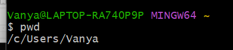

- ls (list) command untuk melihat isi file yang ada di sebuah direktori. Contohnya

- cd (change directory) command untuk pindah ke direktori lain. Contoh:

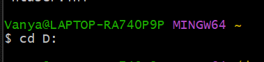
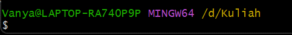

- mkdir yaitu command untuk membuat file baru. Contohnya:

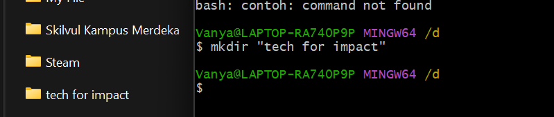

- lalu kita juga dapat membuat file txt baru dengan cara menggunakan command “touch”.

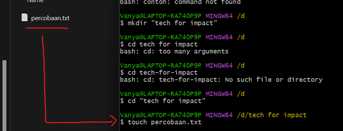

- kita juga bisa melihat isi file dengan command “cat”

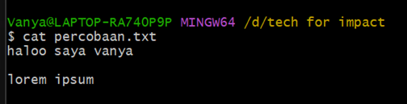

- head yaitu untuk melihat isi file dari bagian atas sedangkan tail melihat file dari bagian bawah. Contoh

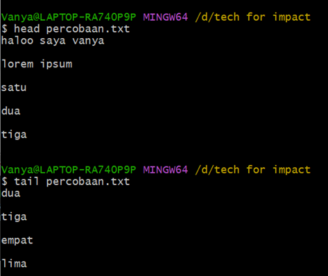

- selain ls atau list gitbash juga bisa pake dir untuk melihat file apa saja yang kita miliki.

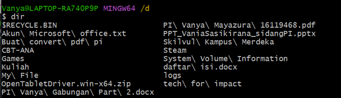

- cp atau copy yaitu untuk menyalin direktori atau file. Contoh

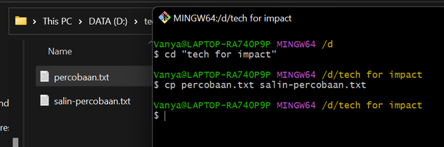

- contoh cp tapi beda tempat atau lokasi penyimpanannya

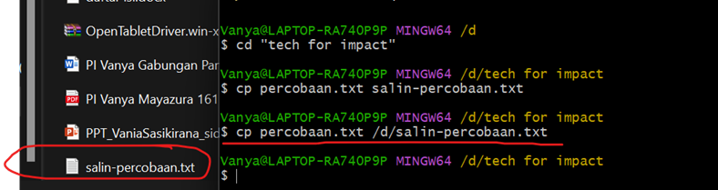

- mv yaitu command untuk memindahkan file ke tempat yang inginkan dan mv juga bisa untuk rename atau mengganti nama pada file. Disini saya akan merubah nama percobaan.txt menjadi vanya.txt.

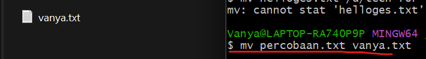

- perintah rm dalam cli yaitu untuk menghapus file atau direktori. Contohnya

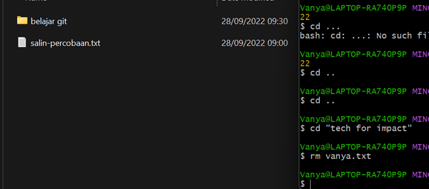

## **Git & GitHub Dasar**

- Git dan Github merupakan tools atau alat yang wejib digunakan untuk para software developer agar dapat berkolaborasi dengan satu sama lain dalam mengerjakan suatu projek
- Menggunakan tools seperti Git dan Github, software dev dapat mengelola kode projek bersama-sama meski berbeda tempat atau dibatasi jarak

### **Apa perbedaan Git dan Github ?**
- Git
    - Version control system yang artinya dapat mencatat perubahan kode sumber secara individu atau tim
    - di install secara lokal terlebih dahulu agar dapat digunakan secara offline
- GitHub
    - untuk menyimpan dan mengelola kode suatu projek
    - berbasis web dan diakses secara online

### **Setup Git dan Github**
- membuat akun GitHub jika belum ada
- Melakukan setup awal dengan git config (E-mail yang disetup harus sama dengan E-mail yang digunakan pada GitHub)

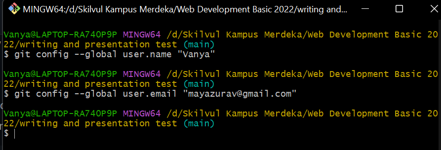

- cek instalasi dengan git version

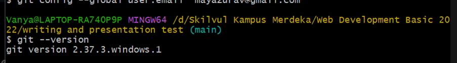

- mengetahui apakah setup berhasil dengan command git config –list

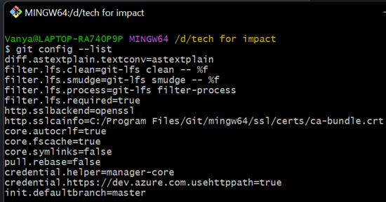

### **Membuat Reporsitory
- Reporsitory adalah direktori atau folder yang dibuat untuk projek, perintah yang digunakan sebagai berikut:

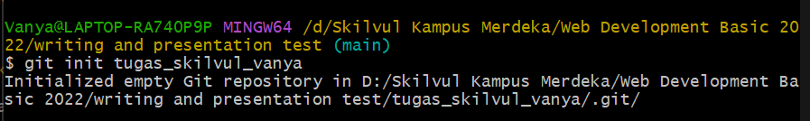

### **HTML**

# writing-and-presentation-test-vanya-week-1
