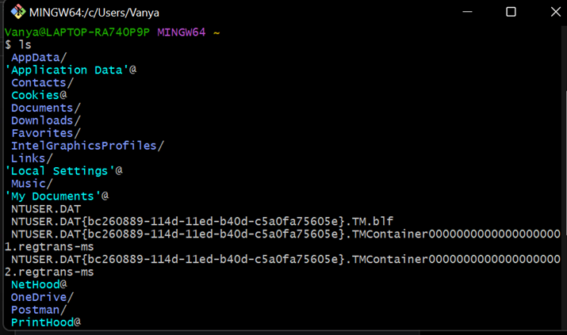

# Writing and Presentation Test Week 1
## **Unix Command Line Git & GitHub Dasar**
### **Penjelasan**
- Command line interface sebenarnya yang dimaksud adalah shell yang berbasis teks. Shell ini program yang menerima perintah lalu meneruskan perintah tersebut ke system untuk dieksekusi.
- Aplikasi dibagi jadi 2 jenis dari 2 segi tampilan, contoh nya.


- GUI bisa kita klik klik, sedangkan lawannya command line dimana hanya berbasis teks saja.
- Contoh CLI yaitu sh, bash, zsh, cmd.exe.
- Filesystem yaitu struktur dari direktori atau file-file yang ada di computer kita. Mengatur bagaimana data disimpan dalam sebuah system. Berikut adalah gambar filesystem dibawah.


- pwd (print working directory) command yang digunakan untuk melihat current working directory.Contohnya (disini artinya bash nya ternyata ada di lokasi c users Vanya).


- ls (list) command untuk melihat isi file yang ada di sebuah direktori. Contohnya



- cd (change directory) command untuk pindah ke direktori lain. Contoh:


- mkdir yaitu command untuk membuat file baru. Contohnya:


- lalu kita juga dapat membuat file txt baru dengan cara menggunakan command “touch”.


- kita juga bisa melihat isi file dengan command “cat”


- head yaitu untuk melihat isi file dari bagian atas sedangkan tail melihat file dari bagian bawah. Contoh


- selain ls atau list gitbash juga bisa pake dir untuk melihat file apa saja yang kita miliki.


- cp atau copy yaitu untuk menyalin direktori atau file. Contoh


- contoh cp tapi beda tempat atau lokasi penyimpanannya


- mv yaitu command untuk memindahkan file ke tempat yang inginkan dan mv juga bisa untuk rename atau mengganti nama pada file. Disini saya akan merubah nama percobaan.txt menjadi vanya.txt.


- perintah rm dalam cli yaitu untuk menghapus file atau direktori. Contohnya


## **Git & GitHub Dasar**

- Git dan Github merupakan tools atau alat yang wejib digunakan untuk para software developer agar dapat berkolaborasi dengan satu sama lain dalam mengerjakan suatu projek
- Menggunakan tools seperti Git dan Github, software dev dapat mengelola kode projek bersama-sama meski berbeda tempat atau dibatasi jarak

### **Apa perbedaan Git dan Github ?**
- Git
    - Version control system yang artinya dapat mencatat perubahan kode sumber secara individu atau tim
    - di install secara lokal terlebih dahulu agar dapat digunakan secara offline
- GitHub
    - untuk menyimpan dan mengelola kode suatu projek
    - berbasis web dan diakses secara online

### **Setup Git dan Github**
- membuat akun GitHub jika belum ada
- Melakukan setup awal dengan git config (E-mail yang disetup harus sama dengan E-mail yang digunakan pada GitHub)


- cek instalasi dengan git version


- mengetahui apakah setup berhasil dengan command git config –list


### **Membuat Reporsitory
- Reporsitory adalah direktori atau folder yang dibuat untuk projek, perintah yang digunakan sebagai berikut:


## **HTML**
- Html digunakan untuk menampilakn konten atau isi pada browser
- Html atau *Hypertext Markup Language* adalah kerangka halaman website dengan menampilkan konten atau berbagai informasi.
- Konten yang ditampilin yaitu seperti gambar, video, text, link, tabel dan lain-lain.

tools yang digunakan untuk menjalankan HTML yaitu:
1. Browser
2. Code Editor

- Browser dan Code Editor yang saya biasa gunakan yaitu Opera GX untuk browser dan Visual Studio Code sebagai Code Editornya.


### **Html Sederhana**
- untuk membuat HTML sederhana perlu mengetahui bagaimana struktur Html
- HTML tersusun dengan tingkatan seperti tree, sebuah elemen dalam elemen lain disebut *child* dan elemen di luar elemen adalah *parent*

Dibawah ini gambar penulisan struktur HTML

```
<!DOCTYPE html>
<html lang="en">
    <head>
        <meta charset="UTF-8">
        <meta name="viewport" content="width=device-width", initial-scale="1.0">
        <title>Week 1</title>
    </head>

    <body>
        <h1>ini adalah heading 1</h1>
        <h2>ini adalah heading 2</h2>
    </body>
    
</html>
```


Ini adalah tampilan HTML sederhana saat dijalankan pada browser


- Menggunakan Live Server dapat lebih efektif pada saat membuat HTML tanpa perlu membuka folder html terus, live server dapat langsung mengupdate html pada saat terjadi perubahan pada file html tersebut

### **Tag HTML Populer**

- Tidak perlu menghafal tag html dengan adanya tag populer
- Sesuai dengan fungsi html yang sudah dibahas, HTML dapat digunakan untuk membuat tabel dan form serta menampilkan gambar dan video ke halaman web

> - **img** digunakan untuk menampilkan gambar dari file lokal atau menggunakan link

``` 
    
```

> - **video** digunakan untuk menampilkan video dari file lokal atau menggunakan link

``` 
    <video controls>
      <source src="..." type="...">
    </video>
```

> - **table** digunakan untuk membuat table

Tag dasar yang selalu digunakan dalam membuat table HTML, yaitu : tr untuk baris, th untuk header, dan td untuk isi tabel

``` 
    <table>
      <tr>
        <th></th>
      </tr>

      <tr>
        <td></td>
      </tr>
    </table>
```

> - **form** digunakan untuk membuat form

Jenis input elemen di dalam form bermacam-macam, ada yang bertipe teks, radio, check, dll

Yang memberi elemen tersebut merupakan bagian dari form adalah jika elemen ada di dalam tag :

``` 
    <form></form>
```
Kode nya bisa kalian coba pada code editor masing-masing:

```
<!DOCTYPE html>
<html lang="en">
    <head>
        <meta charset="UTF-8">
        <meta name="viewport" content="width=device-width", initial-scale="1.0">
        <title>Week 1</title>
    </head>

    <body>
        
        <h1>Halo, Vanya!</h1>
        <table border="1">
            <tr>
                <th>NPM</th>
                <th>TTL</th>
            </tr>
            <tr>
                <td>16119468</td>
                <td>5 Januari 2002</td>
            </tr>
        </table><br>
        <form>
            <label for="nama">Masukkan nama lengkap :</label><br>
            <input type="text" name="nama" id="nama">
            <input type="submit" value="OK">
        </form><br>

        <video width="320" height="240" controls autoplay muted>
            <source src="genshin.mp4" type="video/mp4"> <!--untuk video lokal-->
        </video><br>

        <iframe width="420" height="315"
            src="https://www.youtube.com/embed/tgbNymZ7vqY"> <!--untuk link youtube atau online-->
        </iframe>
    </body>
    
</html>
```


> Note: Diatas merupakan kode program dan hasil pengaplikasian tag HTML populer

### **Semantic HTML**

- Semantic adalah penggunaan elemen HTML sesuai dengan kebutuhan konten untuk memudahkan developer membaca kode program

```
<!DOCTYPE html>
<html lang="en">
    <head>
        <meta charset="UTF-8">
        <meta name="viewport" content="width=device-width", initial-scale="1.0">
        <title>Semantik</title>
    </head>

    <body>
        <header>
            <h1>Ayok kita belajar HTML semantik</h1>
        </header>

        <article>
            <p>Semantic adalah penggunaan elemen HTML sesuai dengan kebutuhan konten untuk memudahkan developer membaca kode program</p>
        </article>

        <footer> Copyright &copy; 2022 by Vanya</footer>
    </body>
    
</html>
```


> Note: Kode program dan hasil pengaplikasian semantic HTML menggunakan header, article, dan footer

### **Deploy HTML**

Apa itu deployment HTML dan apa gunanya?

Deploy HTML adalah sharing aplikasi HTML berbasis web yang sudah kita buat di server agar dapat digunakan orang lain

Deploy HTML memiliki *tools* dengan nama Netlify, langkah untuk deploy projek anda adalah :

- Buka situs netlify.com dan buat akun jika belum punya bisa menggunakan email atau GitHub untuk langsung sign in.
- Selanjutnya upload folder projek


- tahap berikutnya dapat dilakukan dengan mengatur domain

## **CSS**

CSS atau *Cascading Style Sheet* adalah sesuatu yang digunakan untuk mendesain dan mempercantik tampilan HTML

Peran CSS dalam web development yaitu:
- Dapat Mengubah tampilan HTML yang sederhana menjadi lebih menarik dan rapih
- Dapat mengatur tata letak dan ukuran elemen HTML pada web
- Mengelola tampilan dengan CSS lebih efektif dibanding ketika mengatur tampilan menggunakan HTML

### **Menyisipkan CSS ke HTML**

Cara menyisipkan CSS ke HTML ada 3 berdasarkan penempatan kodenya :

> - **inline** adalah cara menuliskan kode CSS langsung pada HTML nya.

``` 
    <h1 style="color:red;"></h1>
```

> - **internal** adalah menuliskan kode CSS di bagian head file HTML

``` 
    <head>
      <style>
        h1 {
          color:red;
        }
      </style>
    </head>
```

> - **external** adalah penulisan kode CSS di luar file HTML dengan mencantumkan link CSS pada bagian head pada HTML, dapat memudahkan developer dalam pembuatan website karena kode CSS nya terpisah dari HTML sehingga lebih efektif

``` 
    <head>
      <link rel="stylesheet" type="text/css" href="...">
    </head>
```

### **Struktur CSS**

Struktur CSS terdiri dari selector, property, dan value

``` 
    selector {
      property:value;
    }
```

> Note: Ada berbagai macam penulisan selector dalam CSS dilihat dari class, id, elemen, dll

### **Penerapan Styling CSS pada HTML**

Dibawah ini merupakan gambar hasil CSS external dari HTML yang sudah kita buat

```
@media screen and (max-width:1920px){
    p {
        padding: 15px;
        margin: 20px;
    }

    h1{
        background-color: blue;
    }
}

@media screen and (max-width:320px){
    p{
        padding: 5px;
        margin: 5px;
    }
}
```


### **Responsive Web Design**

- Responsive web design adalah metode untuk membuat layout dari halaman website yang dapat menyesuaikan diri dengan ukuran layar perangkat user

- Media Query adalah fitur dalam CSS yang memungkinkan pengguna menentukan kapan aturan CSS tertentu diterapkan


Pada kode CSS diatas padding dan margin yang dimiliki oleh elemen paragraph dapat berbeda antara layar yang lebarnya maksimal 320px dan 1920px


Layar memiliki lebar 1920px (monitor) oleh karena itu margin dan padding elemen paragraph masing-masing adalah 15px dan 20px

### **Flexbox**

- Flexbox adalah konsep layout dalam CSS untuk mengatur elemen atau container beserta isinya
- Flexbox mampu beradaptasi dengan ukuran *container*-nya

Properti-properti dalam Flexbox adalah sebagai berikut :

> - **display** adalah langkah pertama untuk membuat sebuah container menjadi flex
> - **flex-direction** digunakan untuk menentukan arah isi container
> - **flex-wrap** memungkinan isi dari container berlanjut ke baris berikutnya
> - **justify-content** digunakan untuk mengontrol alignment dari isi container

```
<!DOCTYPE html>
<html>
<head>
<style>
.flex-container {
  display: flex;
  background-color: DodgerBlue;
  justify-content:space-between
}

.flex-container > div {
  background-color: #f1f1f1;
  margin: 10px;
  padding: 20px;
  font-size: 30px;
}
</style>
</head>
<body>

<h1>Create a Flex Container</h1>

<div class="flex-container">
  <div>1</div>
  <div>2</div>
  <div>3</div>  
</div>

<p>A Flexible Layout must have a parent element with the <em>display</em> property set to <em>flex</em>.</p>

<p>Direct child elements(s) of the flexible container automatically becomes flexible items.</p>

</body>
</html>
```


## **Algorithm & Data Structures**

### **Algoritma**
- Sekumpulan instruksi atau langkah-langkah yang berurut dan digunakan untuk mencapai suatu tujuan
- Disusun secara logis dan sistematis
- Manfaat dilakukannya algoritma adalah untuk memungkinkan developer untuk berpikir analis dan kritis dalam menyelesaikan suatu masalah agar solusi lebih efektif
- Programming sendiri adalah pemecahan suatu masalah oleh karena itu algoritma sudah menjadi bagian penting dalam programming

### **Struktur Data**
- Adalah cara mengatur dan mengorganisir penyimpanan data sedemikian rupa agar operasi dapat dilakukan dengan lebih mudah
- Digunakan untuk mengolah data menjadi terstruktur dan efisien
- Struktur data dapat meningkatkan kualitas dari algoritma

### **Penyajian Algoritma**

Algoritma dapat disajikan dalam 3 bentuk, yaitu :

> 1. **Deskriptif** penulisan algoritma seperti tata cara dengan bahasa sehari-hari
> 2. **Flowchart** adalah penyajian algoritma menggunakan tampilan visual dengan simbol bangun datar
> 3. **Pseudo Code** adalah penulisan algoritma yang menyerupai penulisan kode program

> Note: Pseudo Code bukanlah bahasa pemrograman

### **Contoh Algoritma Sederhana**

Dibawah merupakan sebuah algoritma sederhana yang ditulis dengan penyajian Pseudo Code

``` 
    Rata-Rata Nilai Matematika & Inggris
    deklarasi
      n1 = nilai matematika
      n2 = nilai inggris
      mean = rata-rata nilai matematika & inggris
    kondisi
      jika mean >= 75 maka
        print "Pertahankan"
      tetapi jika mean < 75 maka
        print "Ayo kembangkan lagi"
```

### **Penerapan Algoritma**

Algoritma sederhana yang sudah dibuat dapat diaplikasikan ke dalam bentuk kode pemrograman

``` 
let n1 = 20;
let n2 = 20;
mean = (n1 + n2)/2;
if (mean >= 75) {
  console.log("Pertahankan");
} else {
  console.log("Ayo kembangkan lagi");
}

// outputnya adalah Ayo kembangkan lagi
```

## **JavaScript Dasar**

- Digunakan untuk membuat halaman web lebih dinamis dan interaktif
- JavaScript meningkatkan fungsionalitas web
- Yang membuat JavaScript berbeda dari yang lain adalah DOM (*Document Object Model*) yang memiliki fungsi-fungsi untuk memanipulasi konten

Ada berbagai macam cara untuk menjalankan JavaScript, dapat menggunakan *console browser*, *text editor* seperti Visual Studio Code, Node.js dll

> Note: Biasanya JavaScript dijalankan disisipkan ke dalam HTML yang bertindak sebagai kerangka web

### **Tipe Data JavaScript**

JavaScript mempunyai beberapa tipe data yang perlu diketahui, diantaranya adalah :
- Boolean

``` 
    let x = true;
    let y = false;
```

- Number

``` 
    let num = 20;
```

- String

``` 
    let pesan = "Hello World";
```

- Null

``` 
    let z = null;
```

- Undefined

``` 
    let z;
```

- Object

``` 
    let siswa = {
      nama: 'Vanya';
      npm: '16119468';
    }
```

- Array

``` 
    let buah = ['Kucing', 'Serigala', 'Beruang'];
```

### **Operator JavaScript**

Operator-operator di JavaScript dibagi menjadi beberapa jenis, yaitu :

> - **Operator Aritmatika** biasanya digunakan untuk melakukan perhitungan matematika

``` 
    +     :  Penjumlahan
    -     :  Pengurangan
    *     :  Perkalian
    /     :  Pembagian
    %     :  Hasil bagi
    ++    :  Increment
    --    :  Decrement
```

Contoh penggunaan :

``` 
    let a = 5;
    let b = 2;
    let hasil = a + b;

    console.log(hasil); //7
```

> - **Operator Assignment** digunakan untuk memasukkan suatu nilai ke dalam variabel, dibawah ini adalah operator penugasan beserta contohnya

``` 
    =     :  x = y
    +=    :  x = x + y
    -=    :  x = x - y
    *=    :  x = x * y
    /=    :  x = x / y
    %=    :  x = x % y
```

> - **Operator Perbandingan** digunakan untuk membandingkan sebuah nilai atau variabel dengan variabel lainnya

``` 
    ==    :  Sama dengan
    ===   :  Sama value dan tipe
    !=    :  Tidak sama
    !==   :  Tidak sama value dan tipe
    >     :  Lebih dari
    <     :  Kurang dari
    >=    :  Lebih dari sama dengan
    <=    :  Kurang dari sama dengan
    ?     : Operator ternary (digunakan seperti kondisional)
```

Contoh penggunaan :

``` 
    let a = 1;
    let b = '1';
    banding1 = a == b;
    banding2 = a === b;

    console.log(banding1); //true
    console.log(banding2); //false
```

> - **Operator Logika** digunakan untuk membandingkan kondisi logika antara variable-variable atau value

``` 
    &&    :  AND
    ||    :  OR
    !     :  NOT
```

Prinsip operator logika :

``` 
    trua && true    : true
    true && false   : false
    false && false  : false
    true || true    : true
    true || false   : true
    false || false  : false
    !true           : false
    !false          : true
```

Contoh penggunaan :

``` 
    let a = 1;
    let b = '1';
    banding1 = a == b;
    banding2 = a === b;
    logika = banding1 && banding2;

    console.log(banding1); //true
    console.log(banding2); //false
    console.log(logika); //false
```

> Note:  Hanya memasukkan jenis-jenis operator yang umum

### **JavaScript Control Flow**

- **Conditonal**
  - Merupakan statement percabangan, artinya statement conditional akan mengecek kondisi dan menjalankan perintah berdasarkan kondisi tersebut
  - Perintah yang dijalankan dipilih dari apabila kondisi logika bernilai true

- **Looping**
  - Adalah control flow yang mengulang sebuah instruksi hingga kondisi terpenuhi
  - Looping biasanya digunakan untuk mempersingkat penulisan kode dan menghemat waktu

Nah sudah kelihatan kan perbedaan antara conditional dan looping? Dibawah adalah beberapa control statement conditional dan looping dalam JavaScript yang tidak asing

### **Conditional**

> - **if** digunakan untuk menjalankan blok perintah dalam statement if apabila kondisi itu benar

``` 
    if (kondisi) {
      // kode blok
    }
```

> - **if ... else** adalah percabangan if yang memiliki 2 blok pilihan, dimana pada statement if diberikan sebuah kondisi namun jika tidak terpenuhi maka program akan menjalankan perintah dalam statement else

``` 
    if (kondisi) {
      // kode blok
    } else {
      // kode blok yang dijalankan kalau kondisi false
    }
```

> - **if ... elseif** merupakan percabangan if else yang di dalamnya terdapat pilihan kondisi alternatif lain selain dalam if, else if dituliskan setelah statement if dan bisa lebih dari satu

``` 
    if (kondisi) {
      // kode blok
    } else if (kondisi 2) {
      // kode blok
    } else {
      // kode blok
    }
```

contoh if else if else :
```
let warna = "putih";

if (warna == "black"){
    console.log("saya memakai baju hitam");
} else if (warna == "putih"){
    console.log("saya memakai baju putih");
} else {
    console.log("saya tidak memakai baju putih maupun hitam")
}

// outputnya saya memakai baju putih
```

> - **switch** adalah percabangan yang memilih sebuah case berdasarkan pencocokan dari nilai sebuah case dan statement kondisi

``` 
    switch (kondisi) {
     case ...:
          // kode blok
     break;
     case ...:
          // kode blok
     break;
     default:
          // kode blok
}
```

### **Looping**

> - **for** adalah looping yang biasanya digunakan untuk mengulangi kode jika sudah diketahui banyak perulangannya, di dalam for loop terdapat 3 ekspresi
>   - ekspresi 1 untuk inisialisasi nilai awal
>   - ekspresi 2 adalah kondisi looping berhenti
>   - ekspresi 3 adalah untuk increment/decrement

``` 
    for (ekspresi 1; ekspresi 2; ekspresi 3) {
      // kode blok
    }
```

contoh looping :
```
for(let i = 1; i <= 7; i++){
    console.log("nomor " + i);
}

/// outputnya akan keluar nomor 1 sampai 7 kebawah
```

> - **while** berbeda dengan for, while digunakan untuk perulangan yang memiliki syarat tetapi tidak tentu berapa banyak perulangannya

``` 
    while (kondisi) {
      // kode blok
    }
```

> - **do while** sama seperti while namun jika while melakukan pengecekan kondisi diawal statement, maka do while akan melakukan perintah di dalam blok terlebih dahulu baru melakukan pengecekan kondisi

``` 
    do {
      // kode blok
    } while (kondisi);
```


